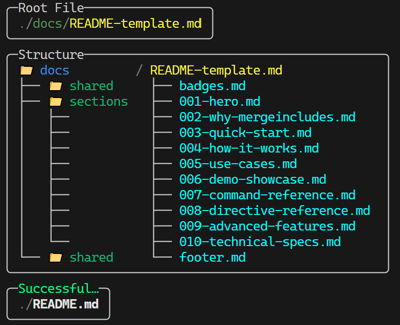

# MergeIncludes

**Merge modular text files with `#include` or `#require` directives.**


*This README is built using MergeIncludes itself*

[](https://dotnet.microsoft.com/)
[](LICENSE)
[]()
[]()

Perfect for **documentation assembly**, **configuration management**, **code generation**, and **complex text workflows**.

---


Many scripting and configuration languages lack native support for modular file structures. `MergeIncludes` addresses that by recursively resolving custom `#include` and `#require` statements—merging multiple files into a single output.

It's designed to be flexible and supports any file type, from source code to plain text.


- 🧩 Recursively resolves `#include` and `#require` statements
- ➕ Supports nested, relative includes
- ♻️ `#require` avoids duplicate includes
- 🌟 Wildcard patterns like `*.md` or `sections/*.txt`
- 👁️ Tree visualization shows file structure
- ⚡ Watch mode for live rebuilds
- 🔗 Clickable terminal paths (where supported)
- 🛡️ Circular reference detection


*Coming soon as a .NET global tool.*

Currently, you can run it directly from source using the .NET SDK:

```sh
dotnet run --project MergeIncludes
```


```sh
mergeincludes <entry-file> [--output <output-file>]
```

* `entry-file`: The root file that contains include directives.
* `--output`: (Optional) Destination file for merged output. Defaults to `entryFile.merged`.


Say you have a file like:

```txt
#require ./intro.txt
#require ./details.txt
```

Running:

```sh
mergeincludes main.txt --output final.txt
```

...produces a single `final.txt` with all dependencies flattened inline.


Download the latest release from [GitHub Releases](https://github.com/electrified/merge-includes/releases) or build from source:

```bash
git clone https://github.com/electrified/merge-includes.git
cd merge-includes
dotnet build -c Release
```


1. **Simple merge**:
   ```bash
   MergeIncludes input.txt -o output.txt
   ```

2. **With tree visualization**:
   ```bash
   MergeIncludes input.txt -o output.txt --tree
   ```

3. **Watch mode for live updates**:
   ```bash
   MergeIncludes input.txt -o output.txt --watch
   ```


**main.md**:
```markdown
# My Document
\#include intro.md
\#include sections/*.md
\#include footer.md
```

**intro.md**:
```markdown
Welcome to my document!
```

**sections/chapter1.md**:
```markdown
Content here...
```

Run `MergeIncludes main.md -o complete.md` to merge everything into one file.


| Directive  | Effect                               |
| ---------- | ------------------------------------ |
| `#include` | Always includes target file content. |
| `#require` | Includes only once per session.      |

Both directives support:
- **Wildcards**: `#include sections/*.md`
- **Relative paths**: `#include ../shared/header.txt`
- **Nested includes**: Files can include other files recursively


* Code pre-processing for languages without import support
* Building monolithic config files
* Flattening modular documentation
* Scripting pipelines with reusable components
* Template-based content generation


This README is built from modular sections using MergeIncludes itself:



The template uses wildcard includes to automatically gather all numbered sections:

```bash
# Build this README (uses wildcard: ./sections/*.md)
MergeIncludes ./docs/README-template.md -o ./README.md

# Watch for changes during development
./docs/update-readme.ps1 -Watch
```

The wildcard `./sections/*.md` includes all numbered sections in alphabetical order, demonstrating the reliable ordering feature.


[GPL-3.0](LICENSE)


MergeIncludes shows you what it's doing with clear tree visualization:


Watch mode rebuilds automatically when files change:


