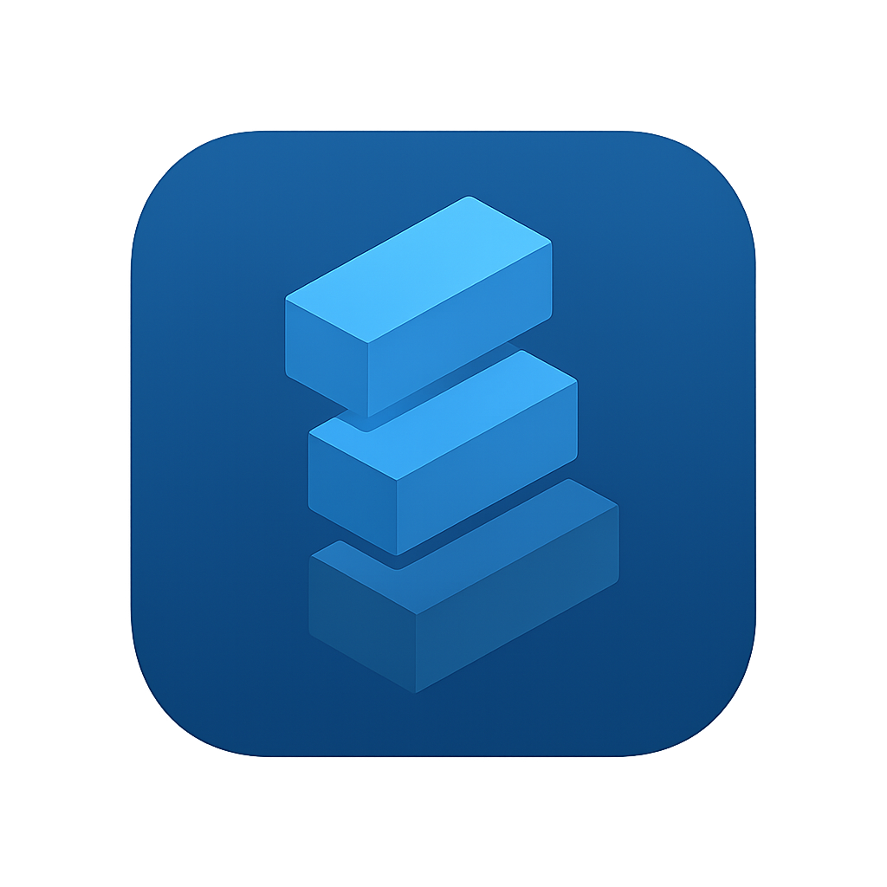

# MergeIncludes

**Merge modular text files with `#include` or `#require`directives.**



*This README is built using MergeIncludes itself*

[](https://dotnet.microsoft.com/)
[](LICENSE)
[]()
[]()

Perfect for **documentation assembly**, **configuration management**, **code generation**, and **complex text workflows**.

---


MergeIncludes processes text files containing `#include` directives and merges them into a single output file. Perfect for documentation, configuration files, and any text assembly workflow.

**Input**: Multiple modular files with include directives  
**Output**: Single unified file with all content merged


Transform your modular text projects into unified masterpieces. **MergeIncludes** recursively processes `##include` directives with beautiful tree visualization, smart terminal integration, and blazing-fast performance.

Perfect for **documentation assembly**, **configuration management**, **code generation**, and **complex text workflows**.


- **Recursive Processing** - Handle nested includes to unlimited depth
- **Smart Directives** - `#include`, `#require`, wildcards, and comments
- **Watch Mode** - Auto-rebuild on file changes for rapid iteration
- **Cross-Platform** - Windows, macOS, Linux ready

- **Interactive Trees** - Visual file structure with clickable links (Windows Terminal)
- **Terminal-Aware** - Optimized display for VS Code, Windows Terminal, and standard terminals
- **Smart Detection** - Automatically adapts to your terminal's capabilities
- **Professional Output** - Clean, formatted results every time

- **Memory Efficient** - Advanced string pooling and caching
- **Fast Processing** - Optimized for large file hierarchies
- **Circular Detection** - Smart prevention of infinite loops
- **Error Resilient** - Graceful handling of missing files and edge cases

---


```bash
dotnet tool install --global MergeIncludes
```

```bash
# Merge a file (creates MyFile.merged.txt)
MergeIncludes MyFile.txt

# Custom output path
MergeIncludes MyFile.txt -o Output.txt

# Watch for changes
MergeIncludes MyFile.txt --watch
```

That's it. Really.

```bash
# This very README is built using MergeIncludes!
cd docs
MergeIncludes ./README-template.md -o ../README.md

# Watch mode for documentation development
MergeIncludes ./README-template.md --watch -o ../README.md
```

*Yes, you're reading documentation that was assembled by the very tool it describes! 🤯*

---


```
📁 project/
├── main.txt
├── sections/
│   ├── intro.txt
│   └── features.txt  
└── footer.txt
```

**main.txt:**
```text
# My Project

#include ./sections/intro.txt
#include ./sections/features.txt
#include ./footer.txt
```


Run `MergeIncludes main.txt` and get `main.merged.txt` with all content combined.


**Documentation** - Assemble user guides from sections  
**Configuration** - Merge environment configs  
**Web Development** - Combine HTML templates  
**Reports** - Build documents from data sections  
**Code Generation** - Template-based file creation  


```bash
# Documentation site
MergeIncludes ./docs/user-guide.md -o ./dist/manual.md

# Configuration deployment  
MergeIncludes ./config/production.yml -o ./deploy/app.yml

# Static site generation
MergeIncludes ./templates/index.html -o ./public/index.html
```

```
📁 docs/
├── 📄 README-template.md     ← Main template
├── 📁 sections/              ← Modular sections
└── 📁 shared/                ← Reusable components
```

*This very README demonstrates the power of modular documentation!*

---


```
╭─Root File──────────────────────────────────────────╮
│ ./docs/README-template.md                          │
╰────────────────────────────────────────────────────╯
╭─Structure─────────────────────────────────────────────────╮
│ 📁 docs                 / README-template.md             │
│ ├── 📁 shared             ├── badges.md [1]              │
│ ├── 📁 sections           ├── why-mergeincludes.md [2]   │
│ │   ├──                   ├── quick-start.md [3]         │
│ │   ├──                   ├── demo-showcase.md [4]       │
│ │   ├──                   ├── directive-reference.md [5] │
│ │   ├──                   ├── use-cases.md [6]           │
│ │   ├──                   ├── command-reference.md [7]   │
│ │   ├──                   ├── advanced-features.md [8]   │
│ │   └──                   ├── technical-specs.md [9]     │
│ └── 📁 shared             └── footer.md [10]             │
╰───────────────────────────────────────────────────────────╯
```

This README demonstrates MergeIncludes in real-world use:

**📁 Documentation Structure:**
```
docs/
├── 📄 README-template.md     ← Main template (you're reading its output!)
├── 📁 sections/
│   ├── 📄 why-mergeincludes.md
│   ├── 📄 quick-start.md
│   ├── 📄 demo-showcase.md
│   ├── 📄 directive-reference.md
│   ├── 📄 use-cases.md
│   ├── 📄 command-reference.md
│   ├── 📄 advanced-features.md
│   └── 📄 technical-specs.md
└── 📁 shared/
    ├── 📄 badges.md
    └── 📄 footer.md
```

**🔄 Build Process:**
```bash
# Generate this README from modular sections
MergeIncludes ./docs/README-template.md -o ./README.md
```

```bash
$ MergeIncludes ./docs/README-template.md --watch -o ./README.md
🔍 Watching for changes... Press any key to stop.

📝 File changed: ./docs/sections/quick-start.md
🔄 Rebuilding README.md... Done! ✨
```

---


```bash
USAGE:
    MergeIncludes <ROOT_FILE> [OPTIONS]

ARGUMENTS:
    <ROOT_FILE>                The file to start processing from

OPTIONS:
    -o, --out <OUTPUT>         Custom output file path
    -d, --display <MODE>       Tree display mode:
                                 Default      - Side-by-side trees
                                 FullPath     - Full file paths  
                                 RelativePath - Relative paths
    -w, --watch               Watch for file changes
    -t, --trim <ENABLED>      Trim empty lines (default: true)
    -p, --pad <LINES>         Add padding lines (default: 1)
        --tree                Show tree visualization only
        --hide-path           Hide source paths in merged output
    -h, --help                Show help information
    -v, --version             Show version information
```

```bash
# Basic merge
MergeIncludes ./main.txt

# Custom output with tree display
MergeIncludes ./docs/guide.md -o ./output/complete.md -d FullPath

# Watch mode for development
MergeIncludes ./project/main.txt --watch --trim false

# Show tree structure only
MergeIncludes ./config/app.yml --tree

# Build this README (meta!)
MergeIncludes ./docs/README-template.md -o ./README.md
```

---


| Directive | Purpose | Example |
|-----------|---------|---------|
| `#include` | Include file content | `#include ./section.md` |
| `#require` | Include only once | `#require ./header.txt` |
| `##include` | Show literal text | `##include ./example.txt` |

- Plain text: `#include ./file.txt`
- Markdown: `<!-- #include ./section.md -->`
- Code: `// #include ./module.js`
- Config: `# #include ./settings.yml`

```text
#include ./docs/*.md        # All .md files
#include ./chapters/0*.txt  # Files starting with 0
```


- **.NET 9.0** or higher
- **Windows 10+**, **macOS 10.15+**, or **Linux** (any modern distribution)
- **Terminal**: Any ANSI-compatible terminal (enhanced features in Windows Terminal)

- **Text Files**: `.txt`, `.md`, `.html`, `.css`, `.js`, `.py`, `.yml`, `.json`, etc.
- **Encoding**: UTF-8, UTF-16, ASCII
- **Size Limits**: Optimized for files up to 100MB (larger files supported)
- **Path Lengths**: Full Windows long path support

- **Missing Files**: Clear warnings with suggested fixes
- **Circular References**: Automatic detection and prevention
- **Permission Issues**: Helpful error messages
- **Invalid Syntax**: Detailed line-by-line feedback

---


MergeIncludes shows you what it's doing with clear tree visualization:


Watch mode rebuilds automatically when files change:


This README is built from modular sections using wildcard includes:

```bash
# Build this README (uses wildcard: ./sections/*.md)
MergeIncludes ./docs/README-template.md -o ./README.md

# Watch for changes  
./docs/update-readme.ps1 -Watch
```

The wildcard includes all numbered sections in order, demonstrating the guaranteed ordering feature.


We welcome contributions! Here's how to get started:

1. **Fork** the repository
2. **Create** your feature branch: `git checkout -b feature/amazing-feature`
3. **Commit** your changes: `git commit -m 'Add amazing feature'`
4. **Push** to the branch: `git push origin feature/amazing-feature`
5. **Open** a Pull Request

```bash
git clone <repository-url>
cd MergeIncludes
dotnet restore
dotnet build
dotnet test
```

```bash
# Update this README from modular source
cd docs
MergeIncludes ./README-template.md -o ../README.md

# Watch mode for documentation development
MergeIncludes ./README-template.md --watch -o ../README.md
```

---


This project is licensed under the **GPL-3.0 License** - see the [LICENSE](LICENSE) file for details.

---


- 🐛 **Bug Reports**: [GitHub Issues](../../issues)
- 💡 **Feature Requests**: [GitHub Discussions](../../discussions)
- 📚 **Documentation**: [Wiki](../../wiki)
- 💬 **Community**: [Discussions](../../discussions)

---

<div align="center">

**⭐ Star this repo if MergeIncludes improves your workflow! ⭐**

*Built with ❤️ using .NET 9 and modern C# practices*

**This README was assembled using MergeIncludes itself - a self-demonstrating example! �✨**

**[Download Latest Release](../../releases) • [View Documentation](../../wiki) • [Join Community](../../discussions)**

</div>


